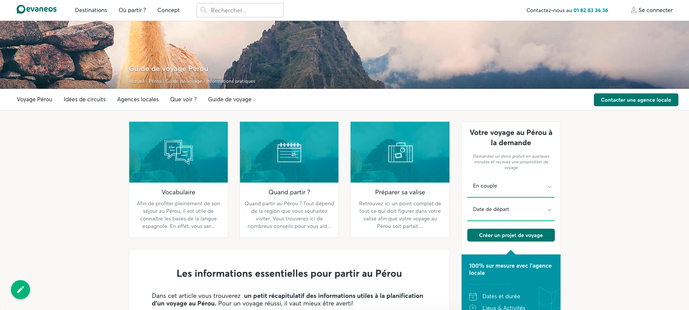
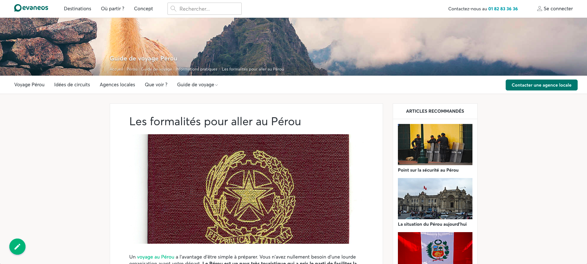

## Demo project for Evaneos

This demo uses the base code from the [prismic-demo](https://github.com/arnaudlewis/prismic-demo).

Here are the [prismic repository](https://evaneos-demo2.prismic.io/) and the [live demo site](https://infinite-falls-69018.herokuapp.com/).

This doesn't have any sort of new or interesting slices. It uses the design from the current Evaneos website.

It contains two different pages: an Information page and an Article page.

------------------------------------

Here are a couple screenshots:

Information Page

Article page

------------------------------------
### License

This software is licensed under the Apache 2 license, quoted below.

Copyright 2017 Prismic.io (http://prismic.io).

Licensed under the Apache License, Version 2.0 (the "License"); you may not use this project except in compliance with the License. You may obtain a copy of the License at http://www.apache.org/licenses/LICENSE-2.0.

Unless required by applicable law or agreed to in writing, software distributed under the License is distributed on an "AS IS" BASIS, WITHOUT WARRANTIES OR CONDITIONS OF ANY KIND, either express or implied. See the License for the specific language governing permissions and limitations under the License.